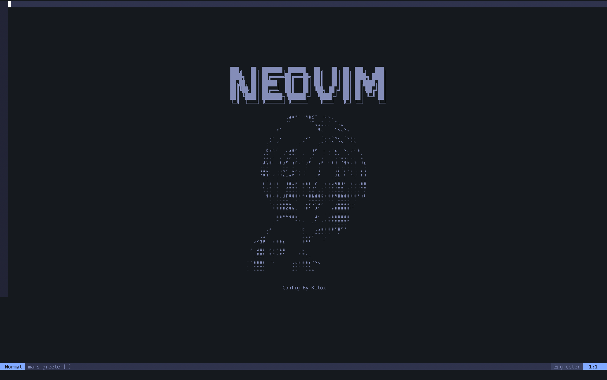

# ☄️ Kilox.nvim

[English](README.md) | [中文](README_zh.md)

个人 Neovim 和 tmux 配置，专注于现代开发体验、AI 辅助编程和生产力。
基于 [Kickstart.nvim](https://github.com/nvim-lua/kickstart.nvim)。



## 📦 安装

### 前置要求

- **Neovim** ≥ 0.10（推荐 0.11+）
- **Git**
- **Nerd Font**（用于图标显示）
- **Node.js**（用于 LSP 服务器）
- **ripgrep**（用于 telescope 搜索）

### 快速安装

```bash
git clone https://github.com/MarsWang42/mars.nvim.git ~/.config/mars.nvim
cd ~/.config/mars.nvim
chmod +x install.sh
./install.sh
```

安装脚本会：
- 在 `~/.config/nvim` 和 `~/.config/tmux` 创建符号链接
- 自动备份现有配置（带时间戳）

---

## ✨ 功能特性

### 🤖 AI 辅助开发

| 插件 | 描述 | 快捷键 |
|------|------|--------|
| **[claudecode.nvim](https://github.com/coder/claudecode.nvim)** | Claude Code 集成，AI 结对编程 | `<leader>cc` 开关, `<leader>cs` 发送选中内容 |
| **[nvim-gemini-companion](https://github.com/gutsavgupta/nvim-gemini-companion)** | Gemini AI 集成 | `<leader>gg` 开关 |
| **[supermaven-nvim](https://github.com/supermaven-inc/supermaven-nvim)** | 快速 AI 代码补全 | 输入时自动建议 |

**Claude Code 快捷键：**
- `<leader>cc` - 开关 Claude Code 终端
- `<leader>cf` - 聚焦 Claude 终端
- `<leader>cr` - 恢复之前的对话
- `<leader>cs` - 发送选中内容到 Claude
- `<leader>cb` - 添加当前缓冲区到上下文
- `<leader>ca` / `<leader>cd` - 接受/拒绝 diff 建议

**Gemini 快捷键：**
- `<leader>gg` - 开关 Gemini 侧边栏
- `<leader>gc` - 切换到 AI 会话
- `<leader>ga` / `<leader>gd` - 接受/拒绝 diff

---

### 🔍 导航与搜索

| 插件 | 描述 | 快捷键 |
|------|------|--------|
| **[telescope.nvim](https://github.com/nvim-telescope/telescope.nvim)** | 模糊搜索文件、内容等 | `<C-p>` 文件, `<leader>sg` 搜索 |
| **[leap.nvim](https://github.com/ggandor/leap.nvim)** | 闪 电般的屏幕内跳转 | `e` 跳转, `E` 跨窗口 |
| **[grug-far.nvim](https://github.com/MagicDuck/grug-far.nvim)** | 跨文件查找替换 | `<leader>gs` |

**Telescope 快捷键：**
- `<C-p>` / `<leader>sf` - 查找文件
- `<leader>sg` - 实时搜索
- `<leader>sw` - 搜索当前单词
- `<leader><leader>` - 查找缓冲区
- `<leader>/` - 当前缓冲区模糊搜索

---

### 📂 Git 集成

| 插件 | 描述 | 快捷键 |
|------|------|--------|
| **[neogit](https://github.com/NeogitOrg/neogit)** | 类似 Magit 的 Git 界面 | `<leader>ng` |
| **[gitsigns.nvim](https://github.com/lewis6991/gitsigns.nvim)** | Git 标记和 hunk 操作 | `]c` / `[c` 导航 |
| **[diffview.nvim](https://github.com/sindrets/diffview.nvim)** | 增强的 diff 查看器 | 通过 Neogit |

**Gitsigns 快捷键：**
- `<leader>hs` - 暂存 hunk
- `<leader>hr` - 重置 hunk
- `<leader>hp` - 预览 hunk
- `<leader>hb` - 显示行 blame
- `<leader>hd` - 与索引比较

---

### 🛠️ LSP 与代码智能

- **自动配置 LSP**：通过 Mason 支持 Go、TypeScript、Python、Lua 等
- **保存时格式化**：使用 conform.nvim（stylua、prettier、gofumpt 等）
- **诊断信息**：内联虚拟文本和浮动窗口

**LSP 快捷键：**
- `grn` - 重命名符号
- `gra` - 代码操作
- `grd` - 跳转到定义
- `grr` - 查找引用
- `gO` - 文档符号
- `L` - 显示行诊断

---

### 🎨 界面与生活质量

| 插件 | 用途 |
|------|------|
| **[tokyonight.nvim](https://github.com/folke/tokyonight.nvim)** | 配色方案，支持透明背景 |
| **[mini.nvim](https://github.com/echasnovski/mini.nvim)** | 状态栏、surround、文本对象 |
| **[which-key.nvim](https://github.com/folke/which-key.nvim)** | 快捷键提示弹窗 |
| **[neo-tree.nvim](https://github.com/nvim-neo-tree/neo-tree.nvim)** | 文件浏览器 (`<C-e>`) |
| **[todo-comments.nvim](https://github.com/folke/todo-comments.nvim)** | 高亮 TODO/FIXME 等 |
| **[vim-tmux-navigator](https://github.com/christoomey/vim-tmux-navigator)** | vim 和 tmux 无缝导航 |

---

## ⌨️ 快捷键速查

| 按键 | 操作 |
|------|------|
| `<Space>` | Leader 键 |
| `jk` | 退出插入/终端模式 |
| `;` | 命令模式（`:`）|
| `tn` / `tj` / `tk` | 新建标签页 / 下一个 / 上一个 |
| `<C-h/j/k/l>` | 导航分屏（兼容 tmux）|
| `e` / `E` | Leap 跳转 |

---

## 📁 目录结构

```
.
├── install.sh          # 安装脚本
├── nvim/
│   ├── init.lua        # 入口文件
│   └── lua/kilox/
│       ├── options.lua     # Vim 选项
│       ├── keymaps.lua     # 全局快捷键
│       └── plugins/        # 插件配置
│           ├── lsp.lua
│           ├── telescope.lua
│           ├── gitsigns.lua
│           └── ...
└── tmux/
    └── tmux.conf       # Tmux 配置
```

---

## 📝 许可证

MIT

